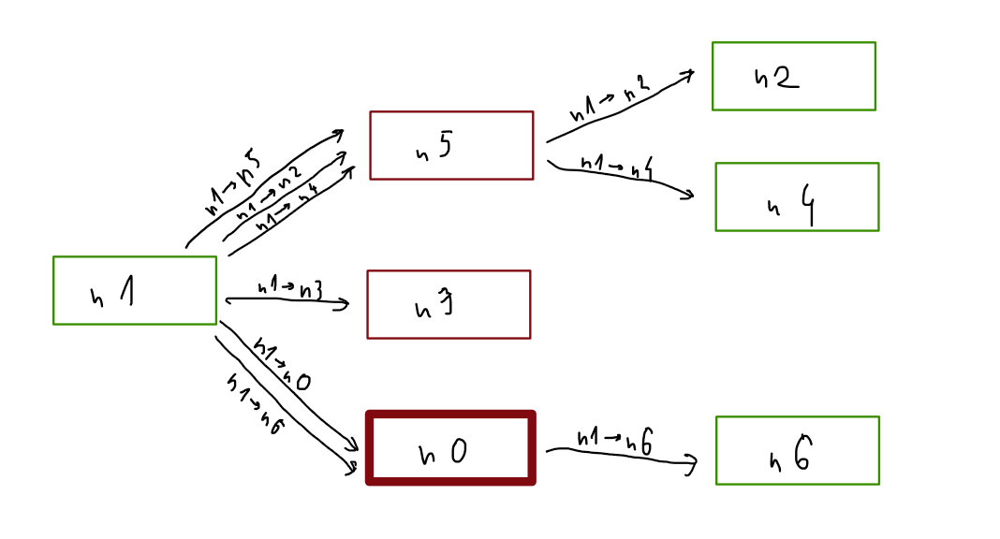
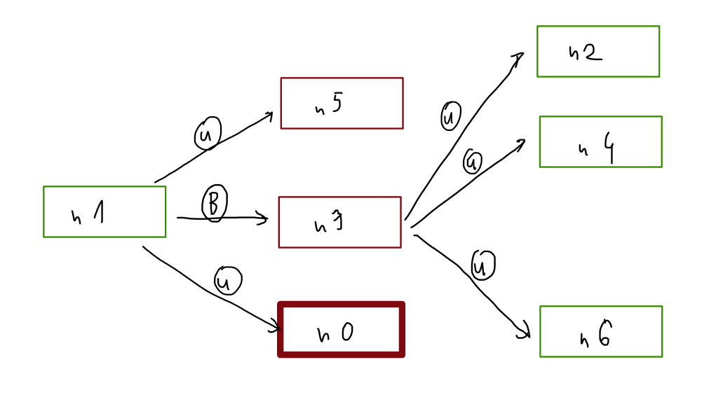

# Obliczenia peer to peer

## Komunikaty

Odbiorca:
- Unicast
- Broadcast

Wiadomości:
- pytanie o listę nodów (unicast do wyróżnionego noda)
- odpowiedź z listą nodów (unicast od wyróżnionego noda)
- broadcast heart beat
- broadcast "zajmuję dane"
- broadcast "obliczyłem"

## Sieć peer to peer

Składa się z nodów:
- publicznych - o adresie ip publicznym
- prywatnych - bez publicznego ip

### Rodzaje połączeń

-   czysty p2p

    Każdy node publiczny komunikuje się bezpośrednio z pozostałymi. Nody prywatne tworzą pośrednie połączenia z innymi nodami prywatnymi poprzez nody publiczne (jeden node prywatny ma nawet lilka połączeń z nodem publicznym. Każde do obsługi innego połączenia nodów prywatnych).

    Broadcast w sieci:

    

    Minus - niepotrzebne mnożenie obciążenia publicznych nodów, nierównomierne obciążenie

    Plus - prosta implementacja. Osobne połączenie dla każdego noda. Broadcast: wysyłamy każdym połączeniem. Unicast: wysyłamy połączeniem przydzielonym do noda, nie musimy wiedzieć, czy jest bezpośrednie, czy nie.

-   Wspólne połączenie

    Jak wyżej, ale "wiązki" połączeń są jednym połączeniem. Node publiczny na podstawie zawartości wiadomości (informacji o adresacie) wybiera dalszą drogę wiadomości. 

-   wybór reprezentanta

    Każdy prywatny node wybiera swojego publicznego reprezentanta, do którego przesyła całą komunikację. Publiczny node musi przetworzyć i dalej rozesłać wiadomości. Broadcast może składać się tylko z jednej wiadomości do noda publicznego, który potem kopiuje i rozsyła wiadomość dalej:

    

    Minus - publiczne nody muszą przetwarzać wiadomości prywatnych nodów. Prywatny node ma bezpośrednie połączenie z innymi publicznymi nodami, którego nie wykorzystuje. Nody inaczej wysyłają wiadomości w zależności od publiczności ich adresu ip (komplikacja kodu)

    Plus - dwukrotnie zmniejszamy ruch broadcastowy. Nie tworzymy osobnych połączeń dla każdej pary nodów prywatnych.

-   hybryda

    Prywatny node wysyła wiadomości bezpośrednio do nodów publicznych, ale za pośrednikiem reprezentanta do prywatnych. Broadcast wygląda następująco:

    

    Minus - każdy node przy wysyłaniu i pośredniczeniu musi sprawdzać, czy odbiorca jest publiczny, czy prywatny. Dodatkowo musi wiedzieć, czy sam jest publiczny, czy prywatny. Dodatkowe skomplikowanie kodu.

    Plus - Rozwiązanie maksymalnie optymalne pod względem obciążenia sieci oraz nodów publicznych. 

