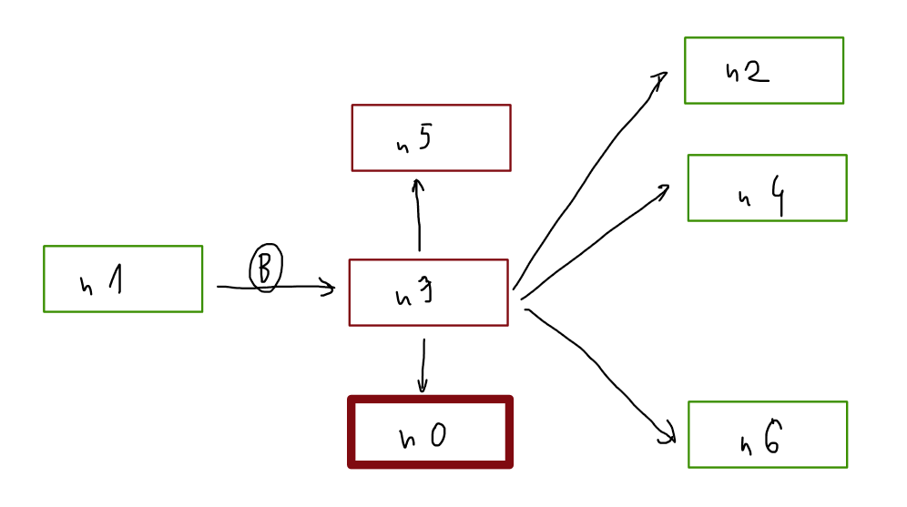
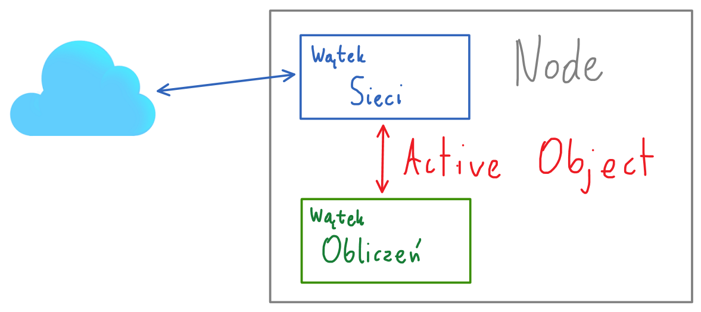
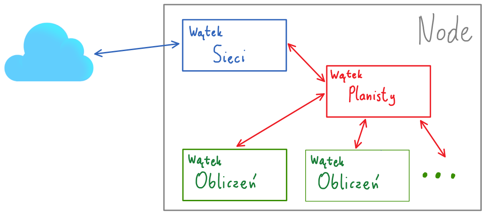

# Obliczenia peer to peer

# Sieć peer to peer

Składa się z nodów:
- <font color="red">publicznych</font> - o adresie ip publicznym (czerwone)
- <font color="green">prywatnych</font> - bez publicznego ip (zielone)
- **<font color="red">publicznego głównego</font>** - o publicznym adresie ip, z którym ma się łączyć każdy node dołączający do sieci. (czerwony pogrubiony)

Rodzaje połączeń:

-   czysty p2p

    Każdy node publiczny komunikuje się bezpośrednio z pozostałymi. Nody prywatne tworzą pośrednie połączenia z innymi nodami prywatnymi poprzez nody publiczne (jeden node prywatny ma nawet lilka połączeń z nodem publicznym. Każde do obsługi innego połączenia nodów prywatnych).

    Broadcast w sieci:

    

    Minus - niepotrzebne mnożenie obciążenia publicznych nodów, nierównomierne obciążenie

    Plus - prosta implementacja. Osobne połączenie dla każdego noda. Broadcast: wysyłamy każdym połączeniem. Unicast: wysyłamy połączeniem przydzielonym do noda, nie musimy wiedzieć, czy jest bezpośrednie, czy nie.

-   Wspólne połączenie

    Jak wyżej, ale "wiązki" połączeń są jednym połączeniem. Node publiczny na podstawie zawartości wiadomości (informacji o adresacie) wybiera dalszą drogę wiadomości. 

    

-   wybór reprezentanta

    

    Każdy prywatny node wybiera swojego publicznego reprezentanta, do którego przesyła całą komunikację. Może go wybrać jednorazowo, lub losować przy każdej próbie wysłania waidomości do noda prywatnego. Publiczny node musi przetworzyć i dalej rozesłać wiadomości. Broadcast może składać się tylko z jednej wiadomości do noda publicznego, który potem kopiuje i rozsyła wiadomość dalej:

    

    Minus - publiczne nody muszą przetwarzać wiadomości prywatnych nodów. Prywatny node ma bezpośrednie połączenie z innymi publicznymi nodami, którego nie wykorzystuje. Nody inaczej wysyłają wiadomości w zależności od publiczności ich adresu ip (komplikacja kodu)

    Plus - dwukrotnie zmniejszamy ruch broadcastowy. Nie tworzymy osobnych połączeń dla każdej pary nodów prywatnych.

-   **hybryda**

    Prywatny node wysyła wiadomości bezpośrednio do nodów publicznych, ale za pośrednictwem reprezentanta do prywatnych. Broadcast wygląda następująco:

    

    Minus - każdy node przy wysyłaniu i pośredniczeniu musi sprawdzać, czy odbiorca jest publiczny, czy prywatny. Dodatkowo musi wiedzieć, czy sam jest publiczny, czy prywatny. Dodatkowe skomplikowanie kodu.

    Plus - Rozwiązanie maksymalnie optymalne pod względem obciążenia sieci oraz nodów publicznych. 


# Komunikaty

Odbiorca:
- Unicast
- Broadcast

## Wiadomości

```
{
    header:
    {
        sender: <priority number>, 
        receiver: <broadcast=-1 | receiver_id>, 
        message_type: <enum>
    }, 
    body:
    { 
        --payload--
    }
}
```

```header``` składa się z pól:
- ```sender``` zawiera identyfikator noda w sieci. Jest to dodatnia liczba całkowita różna dla każdego noda, będąca równocześnie jego priorytetem. Aby zapewnić unikatowość id, node otrzymuje je od        publicznego noda głównego razem z listą nodów w sieci. 
- ```receiver``` zawiera id noda, do którego wiadomość jest skierowana, lub ```-1``` gdy wiadomość jest typu broadcast.
- ```message_type``` przechowuje liczbę będącą identyfikatorem typu wiadomości. Poniżej znajduje się lista typów wraz z ich identyfikatorem oraz opisem ciała.

Pole ```body``` zawiera ciało odpowiednie dla danego typu wiadomości.

### Pytanie o listę nodów
```message_type: 1```

Jest to wiadomość unicast do wyróżnionego noda. 

```
body:
{ 

}
```

### Odpowiedź z listą nodów
```message_type: 2```

Unicast od wyróżnionego noda do noda pytającego. Zawiera listę adresów publicznych nodów, listę nodów prywatnych oraz identyfikator zgłaszającego się noda.

```
body:
{
    public_nodes:
    [
        {id, adress_ip}
    ],
    connected_nodes:
    [
        id
    ],
    your_new_id: <int>,
}
```

### Broadcast powitalny
```message_type: 3```

Pierwsza wiadomość służąca do poinformowania innych nodów o dołączeniu do sieci.

```
body:
{
    
}
```

### Broadcast heart beat
```message_type: 4```

Co ustalony czas broadcast informujący o aktywaności noda w sieci. Jeśli node nie ortzyma takiej wiadomości po pewnym czasie, uznaje node za odłączony.

```
body:
{
    
}
```

### Broadcast "zajmuję dane"
```message_type: 5```

Informuje pozostałe nody, że zajmuje zadanie.
Może powodować konflikt.

```
body:
{
    task_id: <int>
}
```

### Bnicast "ok, zajmuj dane"
```message_type: 6```

Wysyłane po otrzymaniu wiadomości "zajmuję dane" oraz zaznaczeniu w swojej liście zadań jako zajęte. Służy do potwierdzenia, że dany node może zajmować się danym zadaniem.

```
body:
{

}
```

### Broadcast "obliczyłem"
```message_type: 7```

Informuje, że dane zadanie zostało wykonane. Przesyła wynik zadania.

```
body:
{
    task_id: <int>
    result: --suitable--
}
```


## Konflikty rezerwowania danych

### Problem:

Jeśli dwa nody równocześnie wyślą wiadomość "zajmuję dane", powstaje konflikt, ponieważ do niektórych nodów dojdzie jedna wiadomość jako pierwsza, do innych druga.

### Rozwiązanie:

Każdy node podczas dołączanie się do sieci, kiedy prosi node publiczny główny o listę adresów, dostaje od niego priorytet. Jako, że wszystkie priorytety ustala jeden node, każdy node będzie miał inny priorytet. Kiedy nastąpi konflikt, wygrywa go node z lepszym priorytetem. Jako, że wszystkie nody znają priorytety pozostałych, w tablicy zajętych danych będzie zapisany ten, o lepszym priorytecie, niezależnie od kolejności otrzymania wiadomości. Node, który przegrał konflikt, wybiera inne dane i ponawia próbę zajęcia ich. 

# Node

Każdy node składa się z dwóch głównych wątków, które muszą się komunikować: 
- **<font color="blue">Sieci</font>**
- **<font color="green">Obliczeń</font>**

Komunikacja między nimi przebiega z użyciem wzorca ```Active Object```.



Dzięki temu żaden wątek nigdy nie zostaje zablokowany w ramach komunikacji (tak, jak to się dzieje np. przy użyciu wzorca ```Monitor```). ```Active Object``` operuje na strukturze danych obsługującej postęp oraz rezerwacje zadań. Implementacja ```Active object``` zakłada stworzenie kolejnego wątku, dalej nazywanego wątkiem **<font color="red">Planisty</font>**. Dzięki użyciu powyższej architektury, dodanie kolejnego wątku **<font color="green">Obliczeń</font>** nie wymaga żadnych zmian w kodzie. Zależności między wątkami będą zatem wyglądać następująco: 

