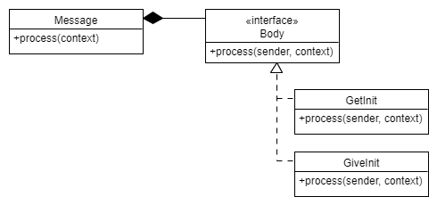
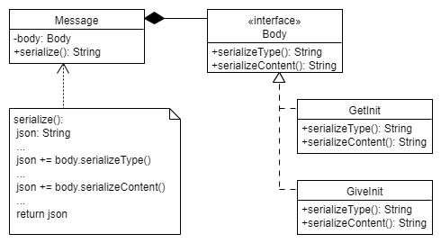

# Wzorce projektowe

Podsumowanie użytych wzorców projektowych. 

## Strategy

Został użyty podczas implementacji różnych typów wiadomości w module [message](./message_module.md).



*Rysunek 1: Wzorzec projektowy strategia.*

Klasa ```Message``` zawiera metodę ```process(context)```, która wywołuje metodę ```process(sender, context)``` na obiekcie klasy implementującej interfejs ```Body```. Metoda ta różni się w zależności od typu ciała. Wiadomość jest zatem przetwarzana w różny sposób w zależności od tego, jaki obiekt ```Body``` jest zawarty w obiekcjie ```Message```. Konkretna strategia dostarczana jest w konstruktorze klasy ```Message```.

Stosując ten wzorzec projektowy unikamy wielkokrotnego sprawdzania typu wiadomości i w zależności od niego uruchamiania różnych fragmentów kodu. Niezależnie od typu wiadomości po prostu wywołujemy na niej metodę ```process```, a w zależności od umieszczonej strategii wykona się właściwy kod. 

Minusem takiego podejścia jest konieczność przekazywania wielu referencji w ramach obiektu ```context```, a nie tylko tych, których potrzebuje dana wiadomość. Mimo to, po zamknięciu wszystkich zmiennych kontekstowych w jednym obiekcie, niewygoda jest minimalna.

## Template method

Został użyty podczas implementacji zamiany wiadomości na reprezentację ```json``` w module [message](./message_module.md).



*Rysunek 2: Wzorzec projektowy metoda szablonowa.*

Metoda ```Message.serialize()``` jest metodą szablonową. Definiuje kolejność zapisywania informacji do reprezentacji ```json```. Jednak ich treść zależy od używanej implemetacji interfejsu ```Body```. 

Dzięki zastosowaniu wzorca "template method" zyskujemy na czytelności kodu oraz skalowalności rozwiązania. Nawet, gdy dodamy więcej implementacji ```Body```, treść metody ```Message.serialize()``` się nie zmieni. 

## Active object

Cały moduł [state](./state_module.md) jest implementacją wzorca projektowego ```Active object```. Jest on opisany dokładnie w donumentacji modułu. 

Dzięki użyciu tego wzorca projektowego możliwy jest asynchroniczny dostęp do tablicy postępu oraz innych zmiennych stanu. Pozwala to na nieprzerwaną pracę komunikujących się wątków i lepszą skalowalność. Możliwy jest nawet podział programu między wiele komputerów (lecz w tym przypadku jest on niepraktyczny). Dodatkowo, można bez dodatkowego nakładu kodu dodać więcej wątków obliczeń, czy UI. Pozwala to na dopasowanie użycia procesora wielordzeniowego do potrzeb użytkownika (może chcieć swobodnie używać komputera podczas obliczeń, lub nie). 

---

[Home](./index.md)