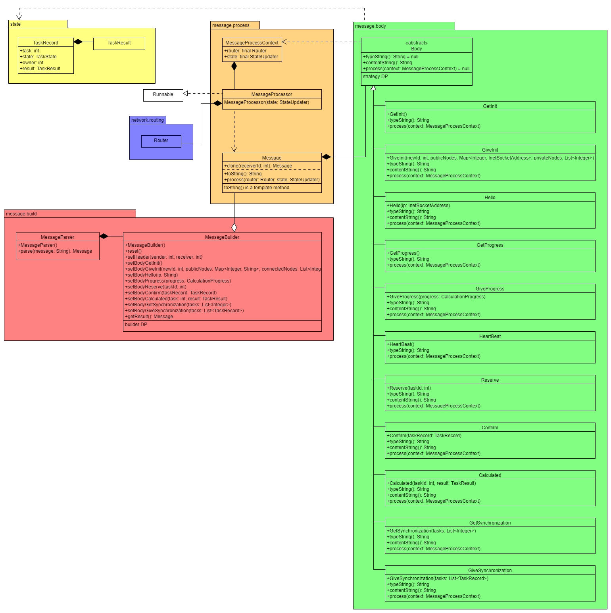

# Moduł message



## Pakiet message

Zajmuje się reprezentacją wiadomości przesyłanej między węzłami oraz jej konstrukcją. 

### Message

Reprezentuje wiadomość przesyłaną w sieci. 

Konstruktor przyjmuje identyfikatory nadawcy i adresata oraz obiekt ```Body``` odpowiedni dla typu wiadomości. 

Metoda ```clone(int receiver)``` klonuje dany obliekt ze zmienionym adresatem. Używana podczas wysyłania wiadomości broadcastowych. Jest implementacją wzorca projektowego "Prototyp". 

```serialize()``` implementuje wzorzec projektowy "template method". Zwraca ciąg reprezentujący wiadomość w formacie json takim, jak [tutaj](./messages.md). Używa do tego celu metod ```Body.serializeType()``` i ```Body.serializeContent()```. 

Metoda ```process(MessageProcessContext context)``` wywołuje ```process(int sender, MessageProcessContext context)``` na obiekcie ```Body``` w ramach wzorca "strategy".

### MessageParser

Zamienia string z wiadomością w formacie ```json``` na obiekt ```Message```.


## Pakiet body

Zajmuje się działaniem ciała wiadomości.

### Body

Jest interfejsem dla każdej wiadomości. 

```serializeType()``` i ```serializeContent()``` zwracają odpowiednio ciąg reprezentujący typ wiadomości oraz jej ciało w formacie ```json```. Używane do komponowania znakowej reprezentacji obiektu.

Metoda ```process(int sender, MessageProcessContext context)``` realizuje wzorzec projetkowy "strategy". Przetwarza wiadomość i aplikuje jej efekty na zgrupowanych obiektach w zmiennej ```context```.

### Implementacje Body

Odpowiadają wszystkim typom [wiadomości](./messages.md). Implementują ich efekty i budowę.


## Pakiet process

Odpowiada za przetwarzanie wiadomości i zmian stanu. Implementuje protokoły sieci peer to peer.

### MessageProcessor

Przetwarza wiadomości w ramach osobnego wątku. Odpowiada za cykliczne wołanie metod ```NodeRegister```, ```HeartBeatEmiter``` i ```StateObserver```. Wątek zasypia maksymalnie na czas ```HeartBeatEmiter.nextBeatTime()``` gdy nie ma nic do roboty. Jest budzony metodą ```Thread.interrupt()``` przez wątek, który dodał jakąś pracę.

### StateObserver

Obserwuje zmiany stanu i tworzy wiadomości, gdy zmiana wymaga poinformowania innych węzłów. 

### NodeRegister

Kontroluje heart beat pozostałych węzłów oraz składuje informacje o pozostałych węzłach w sieci. 

### FutureProcessor

Gdy do przetworzenie wiadomości jest wymagana wartość zwracana przez obiekt ```Future```, niepożądane jest aktywne oczekiwanie na wartość. Aby tego uniknąć, obiekt wraz z kodem dalszego przetworzenia zostają złożone do ```FutureProcessor```

Metoda ```addFutureProcess(condition: Future, process: Runnable)``` dodaje warunek i kod do zbioru oczekujących akcji. 

```tryProcessAll()``` sprawdza dla każdej akcji ```Future.isReady()```. Następnie dla gotowych obiektów uruchamia kod dalszego przetwarzania. 

### HeartBeatEmiter

Kontroluje częstotliwość emitowania wiadomości heart beat. Generuje odpowiednią wiadomość.

### MessageProcessContext

Zawiera obiekty, na które może wpłynąć przetworzenie wiadomości.

---

[Home](./index.md)