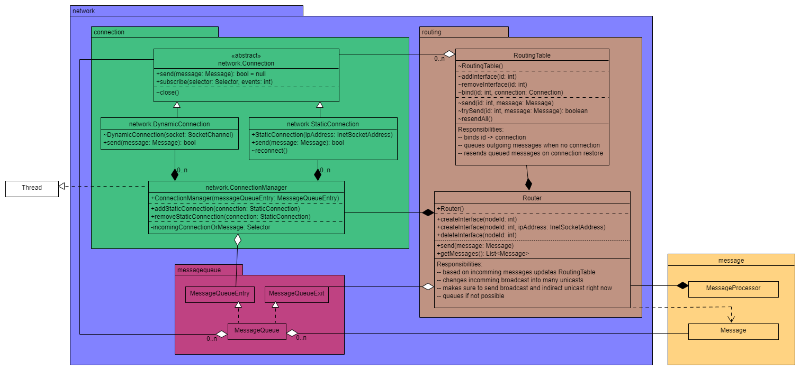

# Moduł network

Nieaktywnie oczekuje na nadchodzące połączenia oraz nasłuchuje równocześnie na wszystkich połączeniach. Zajmuje się niezawodnym wysyłaniem wiadomości i pośredniczeniem w komunikacji.



*Rysunek 1: Diagram UML modułu network*

## Pakiet network.connection

Odpowiada za akceptowanie nowych połączeń i przechwytywanie nadchodzącego ruchu. Gdy połączenie statyczne się zerwie, próbuje je odnowić. 

### Connection

Klasa abstrakcyjna odpowiadająca połączeniu TCP. Umożliwia rejestrację kanału w selektorze na dane wydarzenia oraz wysyłanie wiadomości odpowiednim połączeniem. 

### DynamicConnection

Reprezentuje połączenie nawiązane przez inny węzeł.

### StaticConnection

Reprezentuje połączenie nawiązane przez dany węzeł. Ma możliwość odnowienia połączenia, gdy zostanie urwane.

### ConnectionManager

Działa w ramach osobnego wątku.

```ServerSocketChannel``` nasłuchuje na porcie podanym w pliku konfiguracyjnym lub przy starcie programu. Rejestruje się w obiekcie ```Selector incomingConnectionOrMessage``` na zbiorze zdarzeń ```SelectionKey.OP_ACCEPT```. 

Gdy nowe połączenie oczekuje na danym porcie, jest akceptowane. Zostaje utworzony nowy obiekt ```DynamicConnection(SocketChannel socket)```, do którego przekazywany zostaje zwrócony socket. Następnie nowe połączenie rejestruje się na selektorze na wydarzenia ```SelectionKey.OP_READ```. Obiekt zostaje dodany do listy ```List<DynamicConnection> incomingConnections```. 

Gdy połączenie przychodzące zostanie urwane, jest usuwane z listy ```incomingConnections``` oraz wyrejestrowuje się ze wszystkich selektorów.

Połączenia wychodzące dodawane są metodą ```addStaticConnection(StaticConnection connection)``` dodawane są do listy ```List<StaticConnection> outgoingConnections```. Jedynym sposobem na usunięcie połączenia statycznego jest wywołanie metody ```remoceStaticConnection(StaticConnection connection)```

W sytuacji otrzymania wiadomości, jest ona parsowana na obiekt ```Message```, a następnie zostaje przekazana do kolejki ```MessageQueueEntry``` razem z obiektem ```Connection```, z którego wiadomość przyszła.

## Pakiet network.routing

Odpowiada za niezawodne wysyłanie wiadomości na odpowiednie połączenia. Zarządza przychodzącym ruchem broadcast i wychodzącymi wiadomościami broadcast i pośrednich unicast. 

### Router

Metoda ```createInterface(int node_id)``` zleca stworzenie nowego wpisu w ```RoutingTable```. 

Metoda ```createInterface(int node_id, InetSocketAddress)``` oprócz stworzenia nowego wpisu, tworzy obiekt ```StaticConnection``` z podanym adresem. Następnie dodaje połączenie do listy połączeń statycznych w ```ConnectionManager``` i wiąże ```node_id``` z nowym połączeniem w ```RoutingTable```. 

Aby przerwać połączenie z nodem, który opuścił sieć, wywoływana jest metoda ```deleteInterface(int node_id)```. Usuwa ona wpis w ```RoutingTable``` oraz wymusza zamknięcie powiązanego połączenia. 

Metoda ```send(Message message)``` implementuje niezawodne wysłanie wiadomości w odpowiednie miejssce. Jeśli podana wiadomość jest typu unicast do noda, którego id znajduje się w ```RoutingTable``` (czyli powinno istnieć bezpośrednie połączenie między nodami), wiadomość jest wysyłana za pomocą metody ```RoutingTable.send(Message message)```. Jeżeli wiadomość jest typu broadcast, lub inny node ma pośredniczyć w jej wysłaniu, wysyłana jest metodą ```Router.sendNow(Message message)``` do losowego węzła. W przypadku niepowodzenia, proces jest powtarzany, aż nie skończą się możliwe połączenia. Wtedy wiadomość jest dodawana na odpowiednią kolejkę. Gdy wysyłania wiadomości broadcast się powiedzie, na pozostałe połączenia
wysyłane są unicastowe kopie wiadomości (patrz, [Struktura sieci](./network_structure.md)).

Jeśli dany węzeł jest publiczny, każda wiadomość broadcast jest zamieniana na wiadomości unicast wysyłane metodą ```send(Message message)```

```Router``` przekazuje otrzymane wiadomości dzięki metodzie ```getMessages()```. Wyciąga ona wszystkie wiadomości z kolejki ```MessageQueueExit```. Dla każdej wiadomości z id nadawcy znajdującym się w ```RoutingTable``` aktualizuje połączenie z nim powiązane. Po aktualizacji połączeń wywołuje metodę ```RoutingTable.resendAll()```, próbuje wysłać wszystkie wiadomości pośrednie oczekujące w kolejce. 

Jeśli któraś z otrzymanych wiadomości jest typu broadcast, zamienia ją na wiele wiadomości unicast i rozsyła do wszystkich węzłów prywatnych (posiada odpowiednią listę uzupełnianą podczas wywoływania metody ```createInterface()```). Dodatkowo, porzekazuje przekształconą wiadomość unicast do zwracanej listy.

Jeśli wiadomość jest typu unicast, ale nie jest skierowana do obecnego węzła, jest przesyłana dalej odpowiednim połączeniem. I zostaje usunięta ze zwracanej listy. 

### PublicRouter

### RoutingTable

Wiąże id węzła z odpowiadającym mu połączeniem. 

Metody ```addInterface(int node_id)```, ```removeInterface(int node_id)``` oraz ```bind(int node_id, Connection connection)``` odpowiednio dodają i usuwają rekord w tablicy routingu oraz wiążą id z połączeniem. 

Metoda ```send(int node_id, Message message)``` wysyła wiadomość połączeniem powiązanym z ```node_id```. W przypadku niepowodzenia, dodaje wiadomość do kolejki powiązanej z ```node_id```. 

Metoda ```trySend(int node_id, Message message)``` w przypadku niepowodzenia, nie kolejkuje wiadomości, a tlyko zwraca informację o powodzeniu. 

```resendAll()``` prubuje ponownie wysłać wszystkie wiadomości w kolejkach. 

## Pakiet network.messagequeue

Zawiera kolejkę par ```(Message, Connection)``` oraz interfejsy ```MessageQueueEntry``` i ```MessageQueueExit```, które pozwalają tylko odpowiednio dodawać wiadomości i je pobierać. 

Kolejka używana w ```MessageQueue``` musi być bezpieczna pod względem wielowątkowości, dlatego została użyta ```LinkedBlockingQueue<>```.

---

[Home](./index.md)