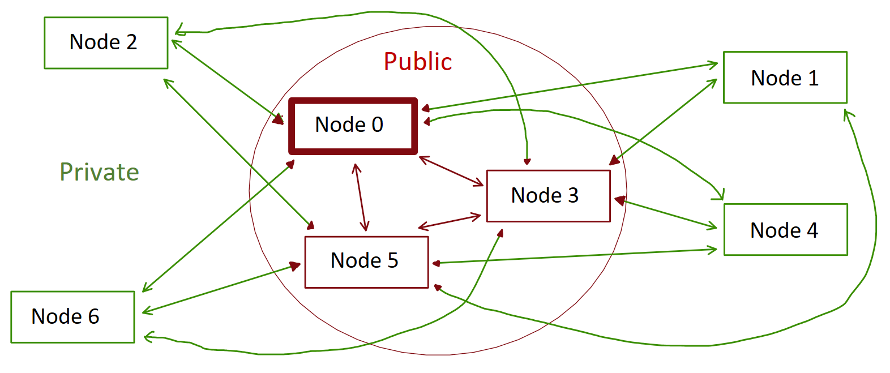
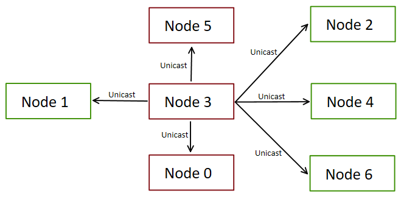
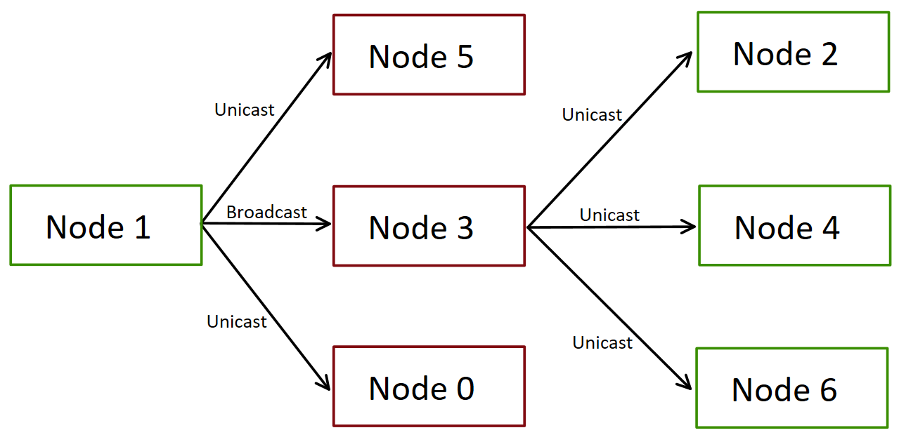

# Struktura sieci

Sieć peer to peer składa się z węzłów:
- **<font color="lightgreen">prywatnych</font>** - bez publicznego adresu ip.
- **<font color="red">publicznych</font>** - o publicznym adresie ip.
- **<font color="red">publicznego głównego</font>** - o publicznym adresie ip, z którym ma się łączyć każdy node dołączający do sieci. Jego adres ip jest udostępniony wraz z programem. (```Node 0```)

## Połączenia w sieci

Ze względu na protokół NAT, niemożliwe jest połączenie się z węzłem prywatnym. Dlatego połączenie <font color="red">publiczny</font> -> <font color="lightgreen">prywatny</font> może być realizowane tylko przez połączenie węzła <font color="lightgreen">prywatnego</font> do <font color="red">publicznego</font>. Dodatkowo, bezpośrednie połączenie <font color="lightgreen">prywatny</font> -> <font color="lightgreen">prywatny</font> jest niemożliwe do realizacji. Takie połączenia realizowane są pośrednio poprzez dowolny węzeł <font color="red">publiczny</font>.



*Rysunek 1: Połączenia w sieci peer to peer.*

Broadcast w sieci nadany przez węzeł <font color="red">publiczny</font> jest wysyłany w postaci wiadomości unicastowych do wszystkich pozostałych nodów bezpośrednimi połączeniami TCP. 



*Rysunek 2: Broadcast nadany przez węzeł <font color="red">publiczny</font> (Node 3).*

Węzeł <font color="lightgreen">prywatny</font> aby wysłać broadcast losuje wśród węzłów publicznych swojego reprezentanta. Wysyła do niego wiadomość oznaczoną jako broadcast, a do pozostałych węzłów <font color="red">publicznych</font> wysyła wiadomości unicast. Reprezentant po otrzymaniu wiadomości broadcast przetwarza ją, i wysyła do wszystkich węzłów prywatnych jako wiadomość unicast. 



*Rysunek 3: Broadcast nadany przez węzeł <font color="lightgreen">prywatny</font> (Node 1).*

[Home](./index.md)