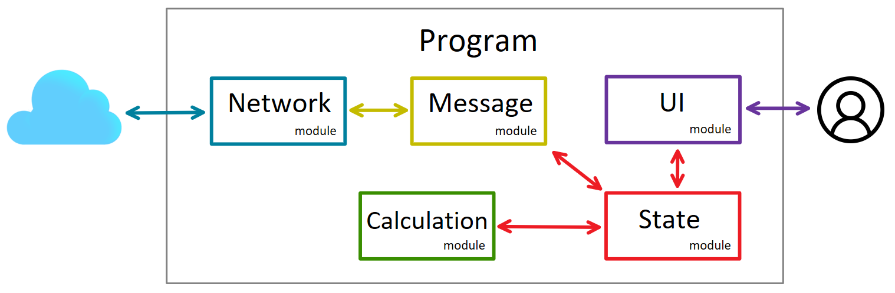
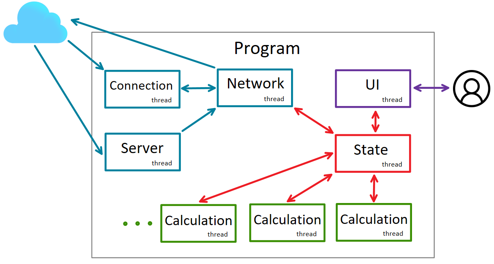

# Struktura programu

Program skłąda się z czterech modułów:
- [Network](./network_module.md) \- obsługuje protokoły sieci, wysyłanie i odbieranie wiadomości.\
- [State](./state_module.md) \- przechowuje i obsługuje postęp obliczeń i inne współdzielone zmienne programu.\
- [Calculation](./calculation_module.md) \- odpowiada za prowadzenie obliczeń i podział problemu na zadania.\
- [UI](./ui_module.md) \- udostępnia komunikację użytkownika z programem.

Moduł sieci komunikuje się z resztą węzłów sieci. W całym przepływie informacji wewnątrz programu uczestniczy moduł stanu. Pozostałe moduły nie komunikują się bezpośrednio ze sobą. 



*Rysunek 1: Model komunikacji między modułami.*

---

## Wątki kontroli

Każdy moduł działa w ramach osobnego wątku. Dodatkowo, do obsługi sieci moduł ```Network``` potrzebuje dwóch dodatkowych wątków. ```Server``` nasłuchuje nadchodzących połączeń i przekazuje je do wątku ```Network```. ```Connection``` odbiera ruch z sieci i doręcza wiadomości wątkowi ```Network```, który je przetwarza i wysyła.

Komunikacja między wątkami ```Network```, ```Calculation``` i ```UI``` przebiega z użyciem wzorca ```Active Object```, który realizuje moduł ```State```.
Dzięki temu żaden wątek nigdy nie zostaje zablokowany w ramach komunikacji. Implementacja ```Active object``` zakłada stworzenie wątku ```State```. Dzięki użyciu powyższej architektury, dodanie kolejnego wątku ```Calculation``` nie wymaga żadnych zmian w kodzie. Zależności między wątkami będą zatem wyglądać następująco: 



*Rysunek 2: Komunikacja między wątkami.*

[Home](./index.md)