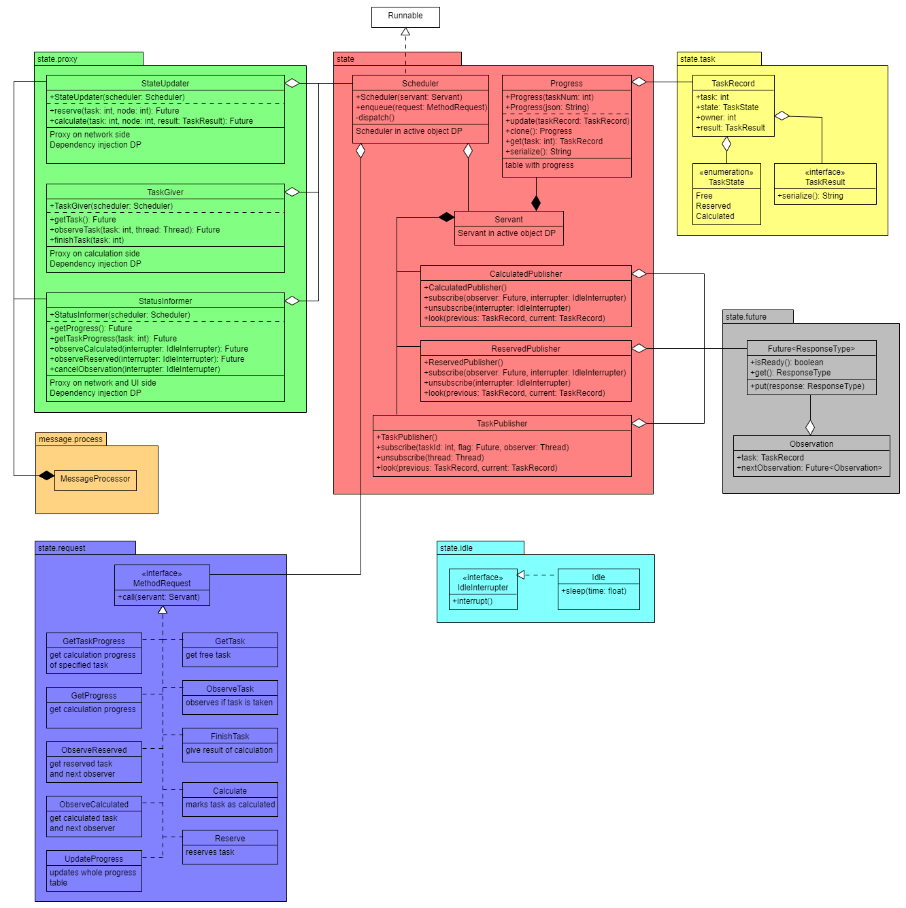

# Moduł state

Działa w ramach wzorca ```Active Object```, dlatego ma własny wątek kątroli wykonujący zlecenia innych wątków dotyczące stanu programu. 



*Rysunek 1: Diagram UML modułu stanu*

## Pakiet state

Zawiera implementację aktywnego obiektu oraz wszystkich obsługiwanych przez niego zbiorów danch.

### Scheduler

Implementacja jest zgodna z wzorcem projektowym "Active object".

Konstruktor poza inicjalizacją pól, uruchamia nowy wątek. Kod jego przebiegu implementuje w metodzie ```run()```. 

Metoda ```enqueue(request: MethodRequest)``` jest wołana przez inne wątki. Dodaje żądania w synchronizowanej kolejce aktywacyjnej.

Jako ```Activation Queue``` użyta została kolejka ```LinkedBlockingQueue```. 
Jest ona bezpieczna pod względem współbieżonści. 

Elementy pobieramy blokująco, ponieważ jest to realizowane przez wątek ```Stanu```, który odpowiada jedynie za obsługę skolejkowanych metod.

Elementy również kładziemy blokująco. Przepełnienie występuje jedynie na skutek "niedomagania" wątku ```Stanu``` i jest to sytuacja patologiczna, która nie powinna wystąpić. Dlatego pozostałe wątki zostaną jedynie spowolnione, a nie wpłynie to na poprawność ich działania. Nie nakładamy żadnych warunków dla wywoływania metod, dlatego mamy pewność, że kolejka kiedyś się opróżni (brak możliwości deadlocka). 

### Servant

Dla każdej klasy implementującej interfejs ```MethodRequest``` zawiera odpowiadającą jej publiczną metodę. 

### Progress

Reprezentuje postęp obliczeń, zajętość zadań oraz ich właścicieli. 

### CalculatedPublisher

Jest asynchroniczną implementacją wzorca projektowego "Observer". Monitoruje zmiany stanów zadań. Jeśli któreś zostanie policzone, informuje obserwujące wątki poprzez metodę ```IdleInterrupter.interrupt()``` oraz zwrócenie wartości do obiektu ```Future```. Gdy informuje o zmianie, podmienia obiekt ```Future``` na ten zwrócony w komunikacie. 

### ReservedPublisher

Jest asynchroniczną implementacją wzorca projektowego "Observer". Monitoruje zmiany stanów zadań. Jeśli któreś zostanie zarezerwowane, informuje obserwujące wątki poprzez metodę ```IdleInterrupter.interrupt()``` oraz zwrócenie wartości do obiektu ```Future```. Gdy informuje o zmianie, podmienia obiekt ```Future``` na ten zwrócony w komunikacie. 

### TaskPublisher

Obserwuje stan konkretnych zadań. Gdy stan zadania się zmieni, informuje subskrybentów oraz usuwa ich subskrybcję. Wywoływana jest metoda ```IdleInterrupter.interrupt()``` oraz flaga ```isReady()``` powiązanego obiektu ```Future``` zostaje podniesiona. 

## Pakiet state.proxy

Zawiera pośredników aktywnego obiektu. Mają dwa zadania. Po pierwsze ukrywają nieergonomiczny kod dostępu do aktywnego obiektu. Po drugie, ograniczają możliwości ingerencji w stan. Konkretnym obiektom przekazujemy tylko te funkcjonalności, których potrzebują. 

### StateUpdater

Wykożystywany przez ```message.process.MessageProcessor``` do aktualizacji stanu na podstawie ruchu z sieci. 

### TaskGiver

Udostępnia funkcjonalności wymagane przez moduł obliczeń.

### StatusInformer

Umożliwia różne metody odczytu postępu obliczeń.

## Pakiet state.task

Odpowiada za reprezentację zadań w systemie

### TaskRecord

Zawiera informacje na temat postępu i ewentualnie wyniku zadania.

### TaskState

Stan zadania: wolne, liczone, obliczone.

### TaskResult

Wynik obliczonego zadania.

## Pakiet state.future

### Future\<ResponseType\>

Kalsa realizująca asynchroniczne zwracanie wyniku we wzorcu "Active object". Nie zawiera żadnej synchronizacji, dlatego ważne jest sprawdzenie gotowości wyniku przed jego pobraniem.

Metoda ```isReady()``` zwraca prawdę, jeśli wynik żądania jest gotowy.

```get()``` zwraca przechowywany wynik. 

```put(result: ResponseType)``` zapisuje wynik, a następnie ustawia flagę gotowości wyniku.

Dla skrócenia zapisu na *Rysunku 1* obiekt ```Future``` jest w pozostałych klasach zapisywany bez specyfikacji typu (lecz w implementacji występuje).

### Observation

Klasa używana przy ciągłej subskrypcji na zmiany stanu obliczeń. Gdy zdarzenie zajdzie, ```Future``` zwróci obiekt ```Observation``` zawierający informacje o zdarzeniu oraz kolejny ```Future``` dalej obserwujący zdarzenia. 

## Pakiet state.request

Interfejs ```MethodRequest``` reprezentuje żądanie wywołania metody na obliekcie ```Servant```. Implementujące go klasy posiadają konstruktor przyjmujący obiekt ```Servant``` oraz dodatkowe parametry. Metoda ```call()``` odpowiada wykonaniu żądania.

## Pakiet state.idle

Klasa ```Idle``` umożliwia kontrolowane uśpienie wątku na określony czas. Śpiący wątek może być wybudzony wcześniej dzięki metodzie ```IdleInterrupter.interrupt()```

---

[Home](./index.md)