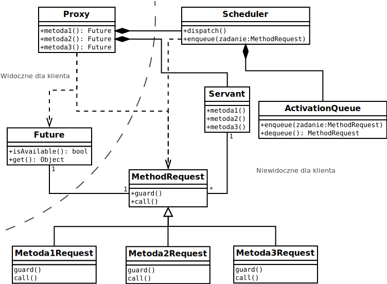

# Moduł stanu

Działa w ramach wzorca ```Active Object```, dlatego ma własny wątek kątroli wykonujący zlecenia innych wątków dotyczące stanu programu. 



*Źródło: https://upload.wikimedia.org/wikipedia/commons/f/f8/Active_object_pl.svg*

## Servant

Klasa Servant jest rdzeniem całego wzorca. To tutaj znajdują się dane, na których operuje ```Active Object```. Dlatego wszystkie publiczne metody dzielą się na dwie kategorie:
- Metody operacyjne - odpowiadają 1:1 wszystkim metodom ```Proxy``` oraz klasom implementującym ```MethodRequest```. Omawiam je w sekcji ```Proxy```.
- Predykaty - używane w implementacji metod ```boolean guard()``` klas implementujących ```MethodRequest```. Udostępniają informacje, dzięki którym ```Scheduler``` może stwierdzić, czy dana metoda może być aktualnie wywołana. 

**W tym przypadku nie zawiera Predykatów, ponieważ [Method Request](#method-request) nie implementuje funkcji ```gruard()```**

Servant operuje na strukturach danych:
- lista zadań i ich stan (wolne, zajęte, obliczone)
- lista/y subskrybentów wzorca ```Observer``` jako obiekty Future zwrócone po użyciu odpowiednich metod. Służą do zawiadamiania innych wątków o zmianie stanu. 

Przykład: ```Wątek Obliczeń``` bierze zadanie i zaczyna liczyć. ```Wątek Sieci``` Zmienia stan tego samego zadania jako zajęte przez inny node na podstawie priorytetu. ```Wątek Obliczeń```, który zasubskrybował o otrzymywanie takiej informacji dostaje nakaz przerwania obliczeń za pośrednictwem zmiany stanu obiektu ```Future```

## Proxy

Jest interfejsem dla stanu obiektu. Jego metody są jedyną drogą komunikacji między innymi wątkami a obiektem. 

- ```Future Proxy.Initialize(myID, progress)```

    Wołane przez wątek ```Sieci```. Inicjuje tablicę postępu oraz informuje o przydzielonym id.

- ```Future Proxy.GetTask()```

    Wołane przez wątek ```Obliczeń```.

    Wybiera pierwsze dostępne zadanie i oznacza jako zajęte przez dany Node. Następnie informuje wątek ```Sieci``` o zajęciu zadania orza zwraca do ```Future``` zadanie.

    Informowanie wątku ```Sieci``` jest zaimplementowane za pomocą wzorca ```Observer``` subskrybującym jest obiekt ```Future```. Informowanie składa się ze zmiany stanu odpowiedniego ```Future``` oraz wybudzenia zainteresowanego wątku.

- ```Future Proxy.ReserveTask(id, task)```

    Wołane przez wątek ```Sieci``` w sytuacji konfliktu przegranego przez noda, dodatkowo informuje wątek ```Obliczeń``` o zmianie rezerwacji.

- ```Future Proxy.CompleteMyTask(task, result)```

    Wołane przez wątek ```Obliczeń``` oznacza zadanie jako wykonane oraz informuje wątek ```Sieci```.

- ```Future Proxy.CompleteTask(id, task, result)```

    Wołane przez wątek ```Sieci```

- Metody subskrybujące/odsubskrybujące

- Metody informacyjne dla UI

## Scheduler

Obsługuje ```Method Request``` pobierane z ```Activation Queue```. Dodatkowo, dodaje, usuwa i informuje subskrybentów wydarzeń. 

Implementuje tworzenie i dodawanie do ```Activation Queue``` obiektów ```Method Request```. 

## Activation Queue

Jako ```Activation Queue``` użyta została kolejka ```LinkedBlockingQueue```. 
Jest ona bezpieczna pod względem współbieżonści. 

Elementy pobieramy blokująco, ponieważ jest to realizowane przez wątek ```Stanu```, który odpowiada jedynie za obsługę skolejkowanych metod.

Elementy również kładziemy blokująco. Przepełnienie występuje jedynie na skutek "niedomagania" wątku ```Stanu``` i jest to sytuacja patologiczna, która nie powinna wystąpić. Dlatego pozostałe wątki zostaną jedynie spowolnione, a nie wpłynie to na poprawność ich działania. Nie nakładamy żadnych warunków dla wywoływania metod, dlatego mamy pewność, że kolejka kiedyś się opróżni (brak możliwości deadlocka). 

## Method Request

Jest w postaci obiektu ```Runnable```. Nie tylko wywołuje metody obiektu ```Servant```, ale również obsługuje subskrypcje. Nie obsługuje warunków wykonania metody (guard). Każdą metodę zawsze można wykonać, ewentualne nieprawidłowości jej wykonania są przekazywane do obiektu ```Future``` i obsługiwane przez zainteresowany wątek.

## Future

Standardowa implementacja

[Home](./index.md)